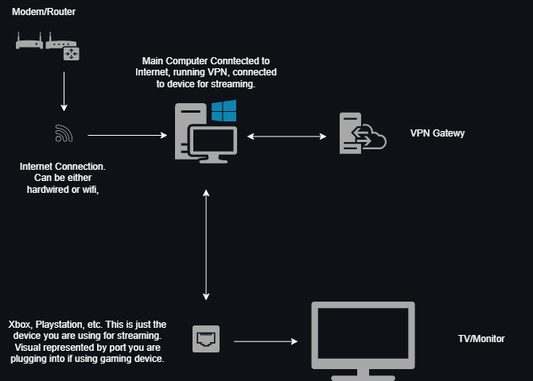

# global_streaming
Repository showing basic setup for global streaming using a gaming device, pc, and vpn to view max content available around geolocation blocking.

## Steps for setting up global streaming using any gaming device, a Windows desktop computer, and NordVPN

1. Connect desktop to the internet
     - (preferably Wi‑Fi, so the Ethernet port stays free for the Xbox).
2. Connect LAN cable: PC Ethernet port to Xbox.
3. Open NordVPN on desktop.
     - In Settings, set the protocol to OpenVPN UDP or OpenVPN TCP (not NordLynx).
     - Then connect to a server.
4. Right‑click the network icon on desktop
    - Go to Network and Internet settings
    - Then to Advanced network settings
    - Then More network adapter options.
       - You should see at least:
       - your Wi‑Fi
       - Ethernet (the Xbox cable)
       - a NordVPN adapter (OpenVPN Data Channel Offload for NordVPN or TAP-NordVPN)
5. Right‑click the NordVPN adapter
    - Then click Properties
    - Then Sharing.
6. Check Allow other network users to connect through this computer’s Internet connection.
7. In the dropdown, choose the Ethernet adapter that goes to the Xbox.
8. Click OK.
